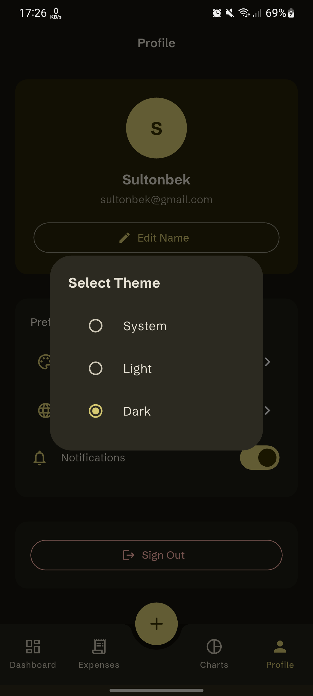
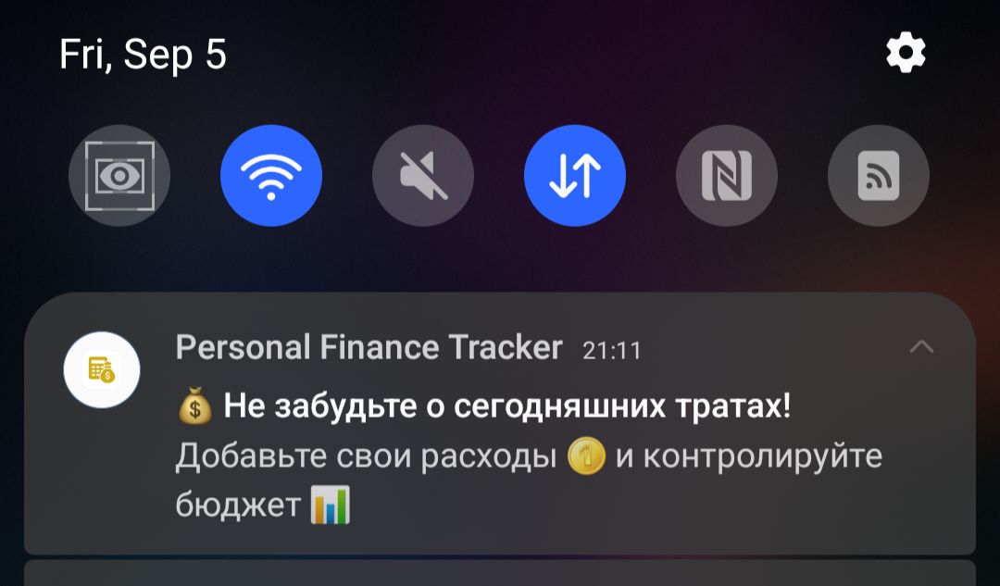
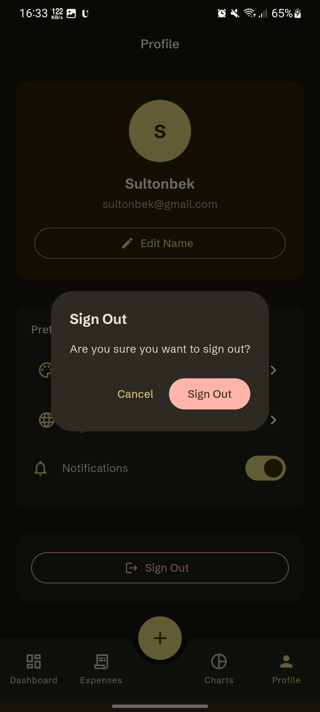

# 💰 Personal Finance Tracker

[](https://flutter.dev)
[](https://dart.dev)
[](https://firebase.google.com)

> A comprehensive personal finance tracking application built with Flutter, featuring real-time expense management, interactive charts, and intelligent notifications. Developed as part of the **Ustoz AI Strong Junior Flutter Developer** assessment.

## 📱 Install APK

Click the button below to download the latest release:

[](apk/app-release.apk)


## 🌟 Key Features

### 🔐 Authentication & User Management
- **Firebase Authentication** with email/password
- **Password Reset** functionality via email
- **Secure user session** management
- **Profile customization** with display name editing

### 💸 Expense Management
- **Add, Edit, Delete** expenses with validation
- **Category-based organization** (11 predefined categories)
- **Real-time data synchronization** with Firestore
- **Date-based filtering** and search functionality
- **Detailed expense descriptions** and amount tracking

### 📊 Advanced Analytics & Visualizations
- **Interactive Pie Charts** with FL Chart integration
- **Category breakdown** with percentage calculations
- **Monthly spending trends** and patterns
- **Quick statistics** dashboard with daily/weekly/monthly views
- **Real-time data updates** across all charts

### 🔔 Smart Notifications
- **Daily expense reminders** with customizable timing
- **Firebase Cloud Messaging** integration
- **Local notifications** with timezone support
- **Permission handling** for Android & iOS

### 🎨 Modern UI/UX Design
- **Material Design 3** implementation
- **Flex Color Scheme** for consistent theming
- **Dark/Light/System** theme support
- **Responsive design** for all screen sizes
- **Smooth animations** and transitions
- **Google Fonts** integration (Schibsted Grotesk)

### 🌐 Internationalization
- **Multi-language support** (English, Uzbek, Russian)
- **Localized content** with intl package
- **Dynamic language switching**
- **RTL layout support** ready

## 🏗️ Architecture & Technical Implementation

### Clean Architecture Pattern
```
📁 lib/
├── 📁 core/                   # Core functionality
│   ├── 📁 config/            # App configuration
│   ├── 📁 di/                # Dependency injection
│   ├── 📁 l10n/              # Localization
│   ├── 📁 navigation/        # Routing & navigation
│   ├── 📁 presentation/      # Shared UI components
│   ├── 📁 service/           # Core services
│   └── 📁 util/              # Utilities & extensions
├── 📁 feature/               # Feature modules
│   ├── 📁 auth/             # Authentication
│   ├── 📁 dashboard/        # Main dashboard
│   ├── 📁 expense/          # Expense management
│   ├── 📁 chart/            # Analytics & charts
│   └── 📁 profile/          # User profile
└── 📄 main.dart             # App entry point
```

### State Management - BLoC Pattern
- **Flutter BLoC** for predictable state management
- **Event-driven architecture** with clear separation of concerns
- **Stream-based reactive programming**
- **Error handling** with localized messages
- **Loading states** with proper UI feedback

### Data Layer
- **Repository Pattern** for data abstraction
- **Firebase Firestore** for real-time database
- **Local caching** with Hive for preferences
- **Data models** with JSON serialization
- **Stream subscriptions** for reactive updates

### Key Technical Features

#### 🔄 Real-Time Data Synchronization
```dart
Stream<List<ExpenseModel>> getExpensesStream(String userId, {DateTime? month}) {
  return firestore
      .collection('expenses')
      .where('userId', isEqualTo: userId)
      .orderBy('createdAt', descending: true)
      .snapshots()
      .map((snapshot) => _convertSnapshotToExpenses(snapshot));
}
```

#### 📱 Responsive Navigation
- **Go Router** for declarative routing
- **Nested navigation** with bottom navigation bar
- **Deep linking** support
- **Route guards** for authentication

#### 🎯 Dependency Injection
- **GetIt** service locator pattern
- **Modular dependency registration**
- **Singleton and factory patterns**
- **Clean separation of concerns**

## 🚀 Getting Started

### Prerequisites
- Flutter SDK 3.29.3+
- Dart 3.7.2+
- Firebase project setup
- Android Studio / VS Code

### Installation

1. **Clone the repository**
   ```bash
   git clone https://github.com/yourusername/finance_tracker.git
   cd finance_tracker
   ```

2. **Install dependencies**
   ```bash
   flutter pub get
   ```

3. **Generate code**
   ```bash
   flutter packages pub run build_runner build
   ```

4. **Firebase Setup**
   - Create a Firebase project
   - Enable Authentication (Email/Password)
   - Enable Firestore Database
   - Enable Cloud Messaging
   - Download and place `google-services.json` (Android) and `GoogleService-Info.plist` (iOS)

5. **Run the app**
   ```bash
   flutter run
   ```

## 📱 Screenshots

### 🔐 Authentication Flow
| Login | Register | Password Reset |
|:---:|:---:|:---:|
|  |  |  |

---

### 📊 Dashboard & Expenses
| Dashboard Overview | Dashboard (scrolled) | Expenses | Year Selection | Expense Search |
|:---:|:---:|:---:|:---:|:---:|
|  |  |  |  |  |

| Add Expense | Update Expense | Delete Expense | Options |
|:---:|:---:|:---:|:---:|
|  |  |  |  |

---

### 📈 Charts & Analytics
| Chart Overview | Year Selecttion | Bar Chart | Pie Chart | Expenses By Category |
|:---:|:---:|:---:|:---:|:---:|
|  |  |  |  |  |

---

### ⚙️ Profile & Settings
| Profile | Edit Name | Theme Light | Theme Dark |
|:---:|:---:|:---:|:---:|
|  |  |  |  |

| English | O'zbek | Русский | Logout |
|:---:|:---:|:---:|:---:|
| <br/> | <br/> |  |  |


## 🎯 Core Functionalities Implemented

### ✅ Authentication System
- [x] Email/Password registration and login
- [x] Password reset via email
- [x] Secure session management
- [x] User profile management
- [x] Logout functionality

### ✅ Expense Management
- [x] Create new expenses with validation
- [x] Edit existing expenses
- [x] Delete expenses with confirmation
- [x] Category-based organization (11 categories)
- [x] Date selection and filtering
- [x] Search functionality
- [x] Real-time data updates

### ✅ Analytics & Reporting
- [x] Interactive pie charts with FL Chart
- [x] Monthly expense totals
- [x] Category breakdown with percentages
- [x] Daily expense trends
- [x] Quick statistics dashboard
- [x] Filter by month and category

### ✅ Notifications
- [x] Daily expense reminders
- [x] Firebase Cloud Messaging
- [x] Local notifications with scheduling
- [x] Permission handling (Android 13+ support)
- [x] Notification settings management

### ✅ UI/UX Excellence
- [x] Material Design 3 implementation
- [x] Dark/Light/System theme support
- [x] Responsive design for phone screen sizes
- [x] Smooth animations and transitions
- [x] Custom color schemes per category
- [x] Loading states and error handling

### ✅ Internationalization
- [x] Multi-language support (EN, UZ, RU)
- [x] Dynamic language switching
- [x] Localized date/time formatting
- [x] Localized number/currency formatting

## 🛠️ Technical Stack

| Category | Technology | Purpose |
|----------|------------|---------|
| **State Management** | BLoC Pattern | Predictable state management |
| **Backend** | Firebase | Authentication, Database, Messaging |
| **Database** | Firestore | Real-time NoSQL database |
| **Local Storage** | Hive | Fast local key-value storage |
| **Charts** | FL Chart | Interactive data visualizations |
| **Navigation** | Go Router | Declarative routing |
| **DI Container** | GetIt | Dependency injection |
| **Localization** | Flutter Intl | Multi-language support |
| **Theming** | Flex Color Scheme | Advanced Material theming |
| **Fonts** | Google Fonts | Custom typography |

## 📊 Performance Optimizations

### Memory Management
- **Stream subscription handling** with proper disposal
- **Efficient widget rebuilding** with BlocBuilder

### Network Optimization
- **Offline-first architecture** with Firestore
- **Firestore query optimization** with proper indexing
- **Pagination** for large datasets
- **Connection state handling**

### User Experience
- **Error boundaries** with user-friendly messages
- **Optimistic updates** for better perceived performance
- **Smooth animations** with proper duration curves

## 🔧 Code Quality & Best Practices

### Architecture Patterns
- **Clean Architecture** with clear layer separation
- **Repository Pattern** for data abstraction
- **SOLID Principles** adherence
- **Dependency Injection** for testability

### Code Organization
- **Feature-based** folder structure
- **Barrel exports** for clean imports
- **Extension methods** for code reusability
- **Custom exceptions** with localization

### Error Handling
- **Result pattern** for operation outcomes
- **Global error handling** with message bus
- **Localized error messages**
- **Graceful degradation** for network issues

## 🎨 Design System

### Color Palette
- **Primary**: Material You dynamic colors
- **Categories**: Unique colors per expense category
- **Semantic colors**: Success, warning, error states
- **Theme variants**: Light, dark, system

### Typography
- **Primary Font**: Schibsted Grotesk
- **Secondary Font**: Hanken Grotesk
- **Proper hierarchy** with Material Design scales
- **Accessibility considerations**

### Components
- **Reusable widgets** with consistent styling
- **Custom input fields** with validation
- **Interactive charts** with smooth animations
- **Context-aware dialogs** and bottom sheets

## 📈 Firebase Integration

### Authentication
```dart
Future<Result<bool>> signIn(String email, String password) async {
  try {
    final userCredential = await auth.signInWithEmailAndPassword(
      email: email,
      password: password,
    );
    return Success(userCredential.user != null);
  } on Exception catch (e) {
    return Failure(e);
  }
}
```

### Firestore Database
```dart
Stream<List<ExpenseModel>> getExpensesStream(String userId, {DateTime? month}) {
  return firestore
      .collection('expenses')
      .where('userId', isEqualTo: userId)
      .orderBy('createdAt', descending: true)
      .snapshots()
      .map((snapshot) => _convertSnapshotToExpenses(snapshot));
}
```

### Cloud Messaging
```dart
Future<void> scheduleDailyExpenseReminder({
  required int hour,
  required int minute,
  required String title,
  required String body,
}) async {
  await _localNotifications.zonedSchedule(
    _dailyReminderNotificationId,
    title,
    body,
    _nextInstanceOfTime(hour, minute),
    const NotificationDetails(
      android: AndroidNotificationDetails(
        'daily_reminders',
        'Daily Expense Reminders',
        importance: Importance.high,
      ),
    ),
    matchDateTimeComponents: DateTimeComponents.time,
  );
}
```

## 🚀 Deployment

### Android
```bash
flutter build apk --release
flutter build appbundle --release
```

### iOS
```bash
flutter build ios --release
flutter build ipa
```

### Build Optimization
- **Code obfuscation** for release builds
- **Asset optimization** for smaller bundle size
- **ProGuard rules** for Android
- **Bitcode** enabled for iOS

## 📋 API Documentation

### Expense Model
```dart
class ExpenseModel {
  final String id;
  final String userId;
  final double amount;
  final String category;
  final String description;
  final DateTime createdAt;
  final DateTime updatedAt;
  final String? imageUrl;
}
```

### Category System
```dart
enum ExpenseCategoryModel {
  food, transport, entertainment, utilities, shopping,
  health, education, travel, home, fitness, other
}
```

## 🔐 Security Features

### Data Protection
- **Firebase Security Rules** for data access control
- **User-based data isolation**
- **Input validation** and sanitization
- **Secure storage** for sensitive data

### Authentication Security
- **Password strength validation**
- **Email verification** support
- **Session timeout** handling
- **Secure logout** with cleanup

## 🌟 Bonus Features Implemented

### Advanced UI Components
- **Custom progress rings** with animations
- **Interactive charts** with touch handling
- **Dynamic theming** based on categories
- **Smooth page transitions**

## Offline Support
- **Firebase offline persistence**
- **User preferences stored with Hive**

## 👨‍💻 Developer

**Sultonbek Tulanov**
- Flutter Developer Candidate
- Email: sultonbektolanov60@gmail.com
- Telegram: https://t.me/pgmr1


---

*This project demonstrates proficiency in Flutter development, Firebase integration, clean architecture principles, and modern mobile app development practices. Built with attention to detail, performance, and user experience.*
